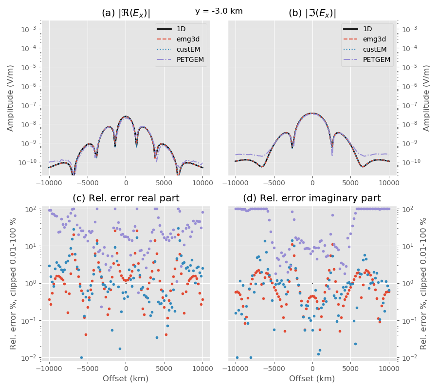
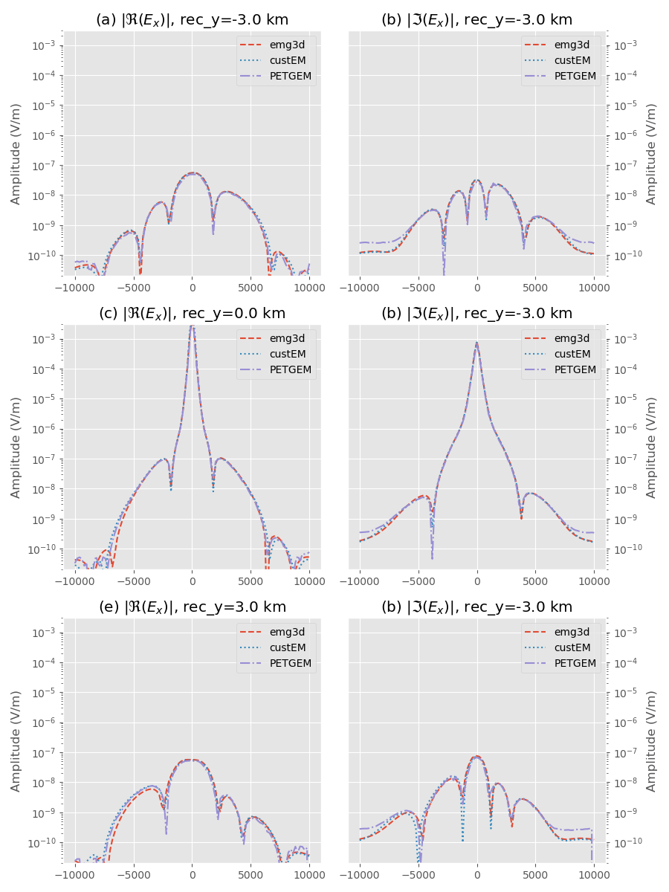

Simple block model
==================

Simple block (one to three blocks) model similar to [MQJM13]_; potentially with
a bit a funkier source (say, finite length rotated bipole and finite length
receivers). In this case I would only compare inline and crossline responses.

- VTI resistivity
- SimPEG => use OcTree for this example? That would be awesome!
- Show Ex, Ey, Ez, Hx, Hy, Hz

Tables:

====== ====== ====== ====== === === ========
Code   Method Mesh   #Cells CPU RAM Computer
====== ====== ====== ====== === === ========
custEM   FE    FE
emg3d    FIT   FD
PETGEM   FE    FE
SimPEG   FD   OcTree
====== ====== ====== ====== === === ========

.. figure:: figures/block-model.png
   :scale: 100 %
   :align: center
   :alt: Block Model.
   :name: blockmodel

   Block model, consisting of a layered background, in which three blocks are
   embedded.

   Comparison of the layered model.

   Comparison of the block model.
